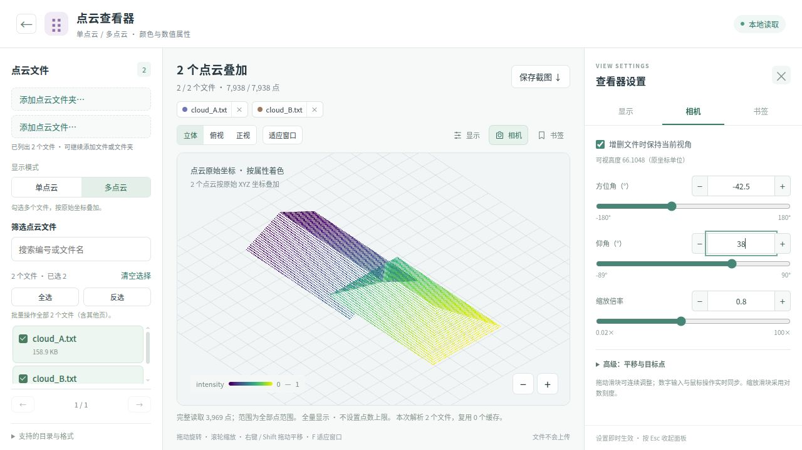

<div align="center">

<h1>BuildingWebViewer</h1>
<p>在浏览器中查看建筑模型、线框与点云。</p>
<p><strong>简体中文</strong> · <a href="README.en.md">English</a> · <a href="https://sen2maker.github.io/BuildingWebViewer/">在线体验 ↗</a></p>

</div>



## 快速开始

**在线使用** → [打开查看器](https://sen2maker.github.io/BuildingWebViewer/)，选择工具，添加本地文件或文件夹，再勾选要查看的对象。

**离线使用** → 下载并完整解压项目，双击 `index.html`。无需安装依赖，推荐使用 Chrome / Edge。

也可以在项目目录启动本地服务（需要 Python 3）：

```bash
python3 server.py
```

打开 **[http://127.0.0.1:8765](http://127.0.0.1:8765)**，按 `Ctrl+C` 停止服务。端口被占用时可加 `--port 8766`。

## 三个查看器

| 工具 | 数据 | 关键功能 |
| --- | --- | --- |
| **LOD 模型** | OBJ 三角网格 | 多栋陈列、实体 / 线框、离地高度着色 |
| **建筑线框** | OBJ 线框 + 可选点云 | 按 ID 子目录读取，最多三组并排对比、相机同步 |
| **点云** | TXT · XYZ · CSV · PTS · PLY · PCD | 多文件叠加、属性着色、几何特征计算与合并导出 |

线框数据按 `数据集 / 对象ID / 线框.obj、点云.txt` 组织。点云文本支持 XYZ 及附加属性，例如 `x y z intensity`。暂不支持 LAS / LAZ 和压缩 PCD。

**显示 · 相机 · 书签**：通过右侧设置栏切换色带、调整数值范围、拖动滑块或精确输入相机参数。视角书签保存在当前浏览器与网址中，支持 JSON 导入导出。

**数据与处理**：查看、重排列并指定 RGB / HSV、法向量、强度或自定义标签；按需计算几何属性，指定新增列位置，再按当前顺序导出 PLY / TXT。[处理说明](docs/PROCESSING.md)

## 使用要点

首页右上角可切换中文 / English，语言会沿用到各工具。手机支持文件选择、单指旋转、双指缩放和平移；文件夹选择和大数据处理能力取决于浏览器及设备内存。

- **数据留在本机**：文件在浏览器内处理，不上传；项目不附带模型数据。
- **项目文件树**：拖入文件 / 文件夹，自动保留目录层级；支持折叠、新建分组、Ctrl / Shift 多选、框选及右键批量管理。勾选热区和拖动手柄独立；左栏可调整宽度或收起。勾选的点云用于显示、计算和合并；分组只影响本次页面，不修改磁盘文件。
- **按需选择**：打开目录后再勾选对象；刷新页面需重新选择数据，已保存书签保留。
- **大文件**：默认显示全部点，也可设置每文件上限；已缓存文件可复用，实际容量取决于内存和显卡。
- **坐标关系**：多点云保留原始坐标，应使用同一坐标系；LOD 模型采用重新排列的展示布局。

## 开发与打包

原生 HTML / CSS / JavaScript + WebGL，无 npm 依赖。源码按职责放在 `src/`，样式位于 `assets/css/`；`assets/js/` 是生成文件，请勿手改。[开发约定](docs/DEVELOPMENT.md)

修改源码后运行：

```bash
python3 build.py --site --zip
python3 scripts/check.py  # 开发检查，需要 Node 18+
```

此命令更新浏览器脚本，并生成静态站点 `_site/` 和程序包 `dist/BuildingWebViewer.zip`。提交修改时一并提交生成的脚本。

实现细节与参考资料见 [设计说明](docs/DESIGN_NOTES.md)。
